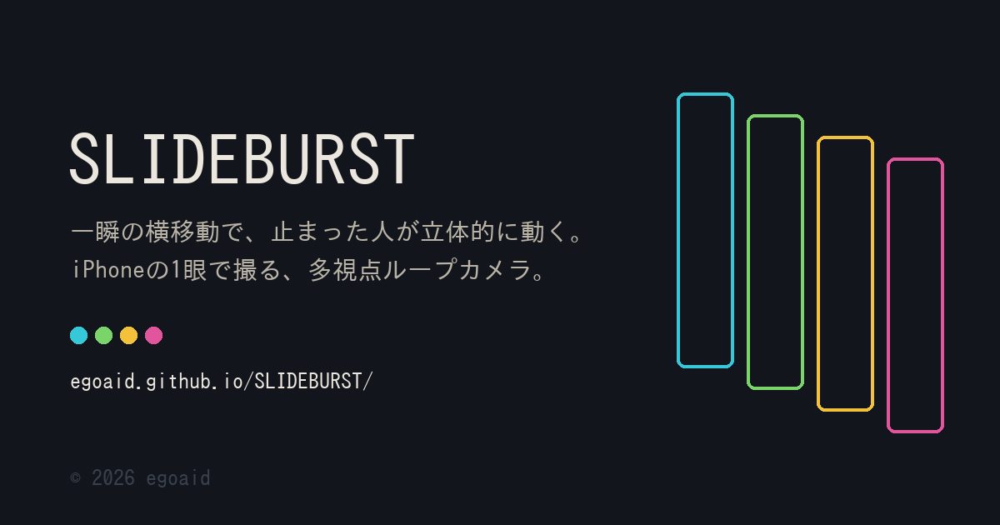

  

# SLIDEBURST

**[egoaid.github.io/SLIDEBURST/](https://egoaid.github.io/SLIDEBURST/)**

止まっている人を、まるで3〜4台のカメラで同時に撮ったみたいに写すカメラです。

やることはひとつ。シャッターを押した一瞬だけ、カメラを横へ滑らせる。
それだけで、被写体は止まったまま、視点だけが左右に動く不思議なループ写真ができます。

動画ではありません。数コマの写真を行ったり来たりさせているだけです。
だから被写体は動かず、奥行きだけが揺れます。

アプリのインストールは要りません。iPhone の Safari、Chrome、Edge でそのまま開けます。

---

## 撮りかた

1. 上のリンクを開いて、**カメラを起動**する
2. 撮影時間を選ぶ。**0.05s か 0.10s** がいちばん面白くなります
3. 被写体に正対して、シャッターを押すのと同時に、**カメラを水平に横へスライド**させる

コツは3つ。

- **手首を回さない。** カメラ本体ごと、真横へ平行に動かす
- **素早く、でもブレない速さで。** 移動量は 5〜15cm くらい。被写体が近いほど少なめに
- **撮影時間は短く。** 長くすると被写体まで動いてしまい、ただの動画になります

うまく撮れると、コマ送りしたときに背景と人物のズレかたが変わって見えます。それが立体感の正体です。

---

## 撮ったあとにできること

**再生** — 使うコマ数と再生速度を変えられます。1→N→2 と往復させるのが基本です。
縦横比も選べます。4:3、1:1、3:4、9:16。切り出す位置は縦に動かせるので、顔の高さに合わせられます。元の写真はそのまま残るので、あとから何度でも切り直せます。

**加工** — Hi8、VHS、8mm、ガラケー、夜ふけ、モノクロ。それぞれ別の機材で撮ったような画になります。8mm はフィルムの揺れとゴミまで、Hi8 は何年も置いたテープの褪せ具合、ガラケーは平成のケータイ写真のあの粗さです。強さも変えられます。
**ブラウン管**を重ねると、古いテレビに映した映像になります。VHS や Hi8 と組み合わせると、当時そのままの見た目になります。
日付の焼き込みもできます。数字は当時のカメラと同じ7セグメント表示で、文字は自由に書き換えられるので、好きな年月日を入れられます。

**落書き** — プレビューの上に直接、線やスタンプを描けます。描いたものは全コマに乗ります。

**作品** — 撮ったものはこの端末の中に自動で保存されます。あとから開いて、フィルターも縦横比も何度でも変え直せます。いらないものは削除できます。どこにも送信されません。

**保存** — できあがったループを**動画**か**GIF**で保存できます。

| 形式 | 向いている場所 |
| --- | --- |
| 動画 | インスタのストーリーやリール、LINE、メッセージ。写真アプリにビデオとして保存されます |
| GIF | どこでも勝手にループします。LINE や X に貼るとき |

動画の長さは 2秒から30秒まで選べます。作品そのものは短いままで、書き出すときにくり返すだけなので、ループの気持ちよさは変わりません。
書き出す枠も選べます。1:1、4:5、9:16、16:9。作品は切らずに枠の中へ収めるので、たとえば 4:3 のブラウン管の作品を、そのままストーリー用の 9:16 で出せます。元の作品は変わりません。

保存ボタンを押すと共有シートが開くので、そこから**写真に保存**を選べば、あとは普通の写真や動画と同じように送れます。
うまく共有できないときは、下のダウンロードからも保存できます。

---

## うまくいかないときは

**カメラが起動しない** — ブラウザのサイト設定でカメラの使用を許可してください。ページを開き直すと聞かれます。

**コマ数が少ない** — 撮影時間を1段長くするか、設定の「記録解像度」を下げてください。解像度が低いほど、短い時間でたくさんのコマが取れます。

**人がブレる** — カメラを動かすのが速すぎます。もう少しゆっくり、でも止まらずに。

**動画で保存できない** — お使いのブラウザが動画の書き出しに対応していません。GIF を選んでください。

---

## 必要なもの

- iOS 15.4 以降の iPhone（Safari / Chrome / Edge）。新しめの Android やパソコンのブラウザでも動きます
- インターネット接続（ページの読み込みだけ。撮った写真はどこにも送信されません）

撮影した画像も、加工した結果も、保存した作品も、すべて端末の中だけで処理されます。サーバーへ送られることはありません。
ブラウザの履歴やサイトデータを消すと、保存した作品も消えます。残したいものは早めに書き出してください。

---

© 2026 egoaid — All rights reserved.
